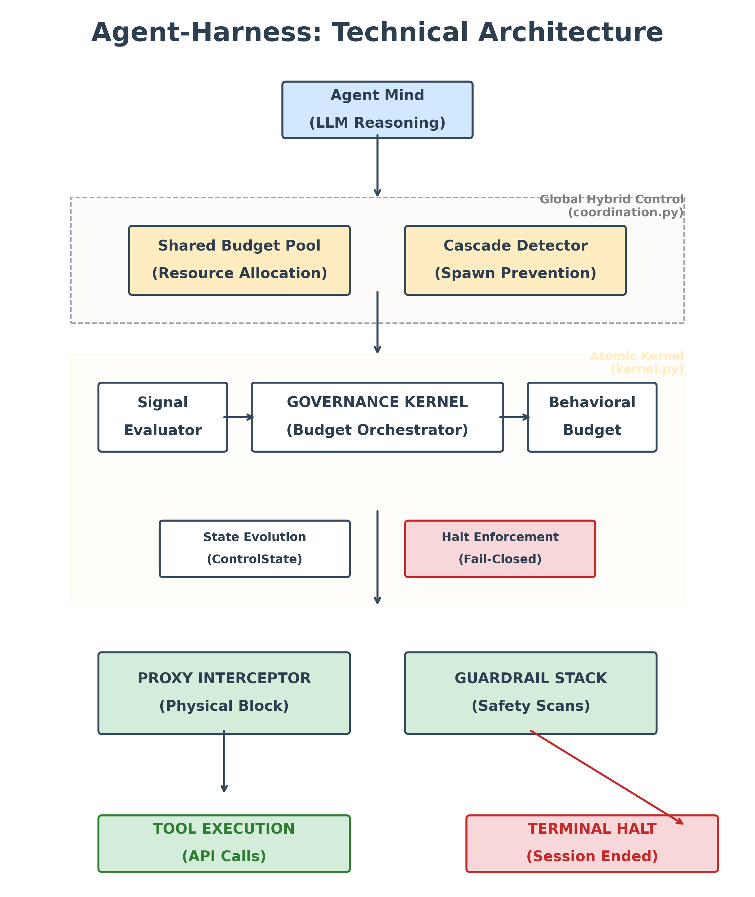
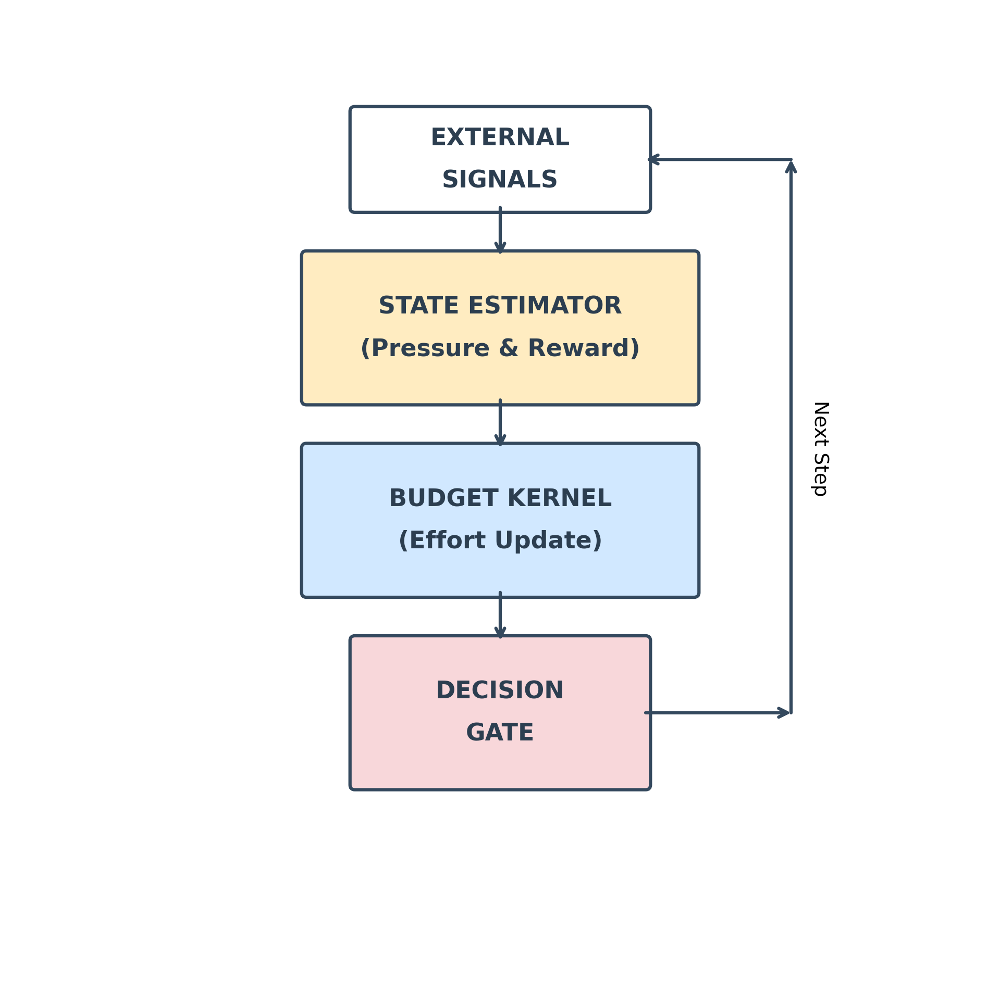
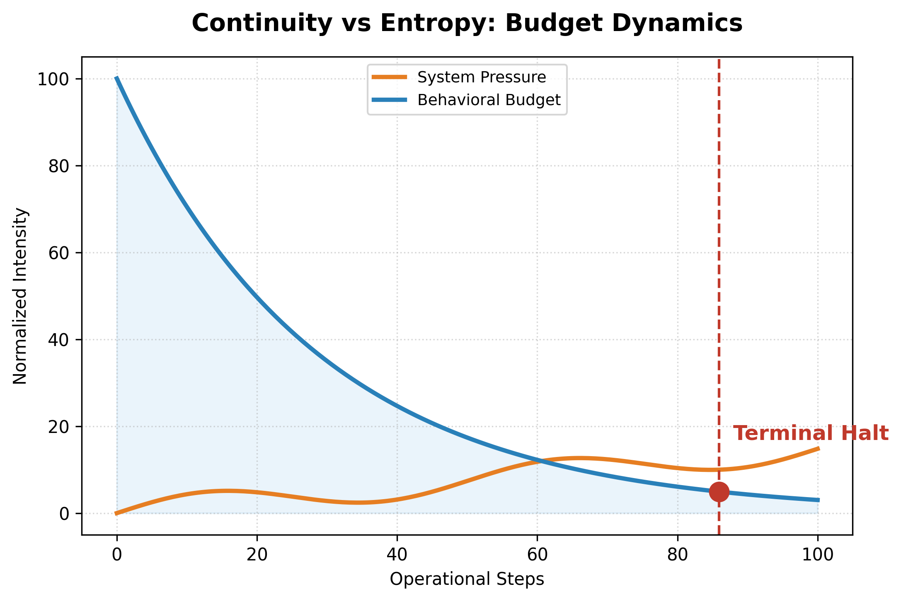
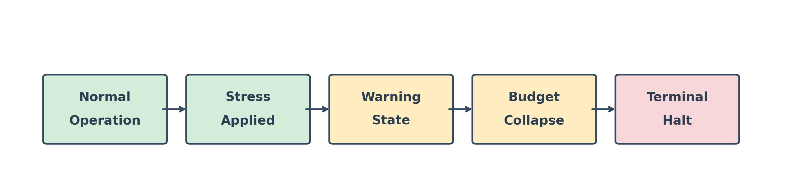

<div align="center">

# 🛡️ Agent-Harness

**A Rigorous Engineering Kernel for Bounded Autonomous Agents**

[](https://pypi.org/project/agentharnessengine/)
[](https://www.python.org/downloads/)
[](https://opensource.org/licenses/MIT)
[](#)
[](https://github.com/Sarthaksahu777/Agent-Harness)
[](https://pypi.org/project/agentharnessengine/)

*Agent-Harness enforces the **15-Point AI Governance Checklist** for safe, deterministic, and bounded autonomous systems by translating environmental signals into strict mathematical execution limits.*

</div>

---

## 📑 Table of Contents
- [What is Agent-Harness?](#-what-is-agent-harness)
- [Motivation](#-motivation--problem-statement)
- [Determinism vs. Industry](#-why-agent-harness-determinism-vs-industry)
- [How Agent-Harness Is Useful](#-how-agent-harness-is-useful)
- [Deployment & Installation](#-deployment--installation)
- [Architecture](#-architecture)
- [Visual Budget Dynamics](#-visual-budget-dynamics)
- [Failure Mode Progression](#-failure-mode-progression)
- [System Behavior](#-example-system-behavior)
- [Core Components](#-core-components)
- [Governance Checklist](#-the-15-point-ai-governance-checklist)
- [Failure Semantics](#-failure-semantics)
- [Integrations](#-integrations)
- [Project Structure](#-project-structure)
- [Performance](#-performance--efficiency)
- [Anti-Gaming](#-anti-gaming--robustness)
- [Observability](#-observability-and-logging)
- [Security Model](#-security-model)
- [Threat Model](#-threat-model)
- [Limitations](#-limitations)
- [Roadmap](#-roadmap)

---

## ❓ What is Agent-Harness?

**Agent-Harness** is a deterministic governance runtime that acts as a non-bypassable **Runtime Execution Firewall** between an agent's reasoning loop and real-world execution surfaces. It translates environmental feedback (risk, effort, stagnation) into strict mathematical execution budgets. When an agent exceeds its bounds, the Harness **forcibly terminates** execution.

---

## 🛑 Motivation / Problem Statement

Autonomous agents rely on "soft" boundaries (prompt engineering, RLHF). Under sustained failure or adversarial conditions, agents ignore these and enter unbounded loops. Agent-Harness replaces soft boundaries with a **runtime execution firewall** that dynamically tracks Effort, Exploration, and Risk. Once budgets deplete, permission to execute *always collapses*.

---

## 💎 Why Agent-Harness? Determinism vs. Industry

Most AI safety solutions are **probabilistic** (LLM validation) or **stateless** (regex). Agent-Harness introduces **Stateful Determinism**—enforcing physical runtime bounds that an agent cannot reason its way out of.

### 📊 Agent Governance Comparison

| Dimension | **Agent-Harness** | Industry Standard (Typical) | Examples |
| :--- | :--- | :--- | :--- |
| **Core Goal** | Deterministic runtime governance and halting | Orchestrate agent workflows | LangGraph, CrewAI |
| **Control Layer** | **External execution governor** | Internal framework logic | LangChain, AutoGen |
| **Halting Logic** | **Dynamic signals** (effort, risk, stagnation) | Static limits (max steps, timeout) | `max_iterations`, `timeout` |
| **Failure Handling** | **Fail-closed deterministic halt** | Retry / timeout / fallback | API retry logic |
| **Loop Awareness** | Observes step-by-step runtime signals | Blind to runtime dynamics | Prompt → tool → response |
| **Governance Loc.** | **Outside the reasoning system** | Embedded inside agent loop | Typical agent frameworks |
| **Model Dependency** | **Model-agnostic** | Often tied to framework/model | OpenAI Agents SDK |
| **Observability** | Governance metrics (halt reason, pressure) | Logging and tracing only | LangSmith, Arize Phoenix |
| **Stability** | Designed to prevent runaway loops | Usually handled manually | Ad-hoc guards |
| **Philosophy** | **Collapse over escalation** | Graceful degradation | Retries |
| **Determinism** | **Deterministic decision logic** | Mostly probabilistic behavior | LLM reasoning |
| **Integration Role** | Governance wrapper around agents | Full agent framework | AutoGen, CrewAI |

### 🏢 Architectural Comparison With Real Systems

This table compares Agent-Harness against real industry systems at the **architectural level**, not just features.

| Dimension | **Agent-Harness** | **NeMo Guardrails** (NVIDIA) | **Llama Guard** (Meta) | **Guardrails AI** | **HAL Harness** | **AgentGuard** (Research) |
| :--- | :--- | :--- | :--- | :--- | :--- | :--- |
| **Architecture** | External Sidecar / Proxy Kernel | Conversational Orchestration Layer | Fine-tuned LLM Classifier | Python Validator Framework | Offline Evaluation Suite | Online MDP Verifier |
| **Enforcement** | Physical halt (403 / process kill) | Dialog steering / topic blocking | Binary safe/unsafe classification | Input/Output validation | None (post-hoc scoring) | Probabilistic guarantees |
| **When It Acts** | **Runtime** (every step) | Runtime (conversational) | Pre/Post generation | Pre/Post generation | **After execution** | Runtime (observation) |
| **State Model** | **Full behavioral trajectory** (effort, risk, exploration budgets) | Conversation history only | Stateless (per-request) | Stateless (per-request) | Stateless (per-benchmark) | Dynamic MDP model |
| **Determinism** | **Absolute** (closed-form math) | Probabilistic (Colang + LLM) | Probabilistic (LLM inference) | Heuristic (regex + validators) | N/A | Probabilistic |
| **Latency** | **~0.06ms** (pure math) | ~100ms (LLM routing) | ~200ms+ (model inference) | ~10ms (regex/pydantic) | N/A | Varies |
| **Bypassability** | **Non-bypassable** (sidecar) | Moderate (in-app) | Moderate (wrapper) | High (in-process) | N/A | Low (external) |
| **Best For** | **Autonomous agent execution** | Chatbot topic safety | Content moderation | Output format validation | Agent benchmarking | Research verification |

**Key Insight:** Most industry systems focus on **what an agent says** (content safety). Agent-Harness focuses on **whether an agent is allowed to keep acting** (behavioral governance). These are fundamentally different architectural concerns.

---

## 🔧 How Agent-Harness Is Useful

**1. Prevent Runaway Loops** — Agents frequently retry failing tools indefinitely. Agent-Harness detects stagnation (zero reward across steps) and halts execution deterministically via `FailureType.STAGNATION`.

**2. Bound LLM API Costs** — Effort budgets drain faster when the agent fails to produce real environment progress, preventing token burn from "reasoning theater" (verbose monologue with zero action).

**3. Secure Tool Execution** — Every tool call passes through `GuardrailStack` before execution, blocking dangerous code patterns (`os.system()`, `exec()`, PII leakage). The dangerous call **never reaches the execution surface**.

**4. Multi-Agent Stability** — `SharedBudgetPool` and `CascadeDetector` enforce global budget limits across swarms, preventing cascading agent spawn failures.

**5. Compliance Audit Trails** — SHA256 hash-chained JSONL logs provide tamper-evident, non-repudiable decision history for regulated environments (finance, healthcare, enterprise).

Agent-Harness uses deterministic budget math to guarantee bounded execution without LLM inference.

---

## 🚀 Deployment & Installation

### Local Engine Setup
Install the lightweight engine via pip to integrate governance into your Python logic:
```bash
# Install via pip
pip install agentharnessengine

# Or install from source
git clone https://github.com/Sarthaksahu777/Agent-Harness
cd Agent-Harness
pip install -e .
```

### Docker Proxy (Production Ready)
Deploy a non-root, multi-stage optimized governance proxy in seconds. This is the recommended method for production environments to ensure non-bypassable enforcement:

```bash
# Start the Governance Proxy + Metrics Stack
docker-compose -f deployment/docker-compose.yml up -d

# Check health
curl http://localhost:8080/health
```
*The proxy exposes port `8080` (Production) and `8081` (Dev/Hot-reload).*

### Quick Start (Engine Only)
A minimal, framework-free implementation of the engine checking a basic step progression:

```python
from governance.kernel import GovernanceKernel
from governance.profiles import BALANCED

# 1. Initialize the Kernel with a standard behavioral profile
kernel = GovernanceKernel(profile=BALANCED)

# 2. Simulate environmental signals on an agent step
result = kernel.step(reward=0.6, novelty=0.1, urgency=0.0)

if result.halted:
    print(f"TERMINATED: {result.failure}")
else:
    print(f"ALLOWED. Remaining Effort: {result.budget.effort:.2f}")
```

---

## 🏗️ Architecture

Agent-Harness intercepts execution across three distinct, modular layers. It strictly separates the "Mind" (Agent Reasoning) from the "Body" (Tool Execution).

<p align="center">

</p>

### LEVEL 1: High-Level System Model
- **Agent (Mind)**: The LLM controller generating tool inputs and plans. It never touches APIs directly.
- **Agent-Harness (Governance Runtime)**: The non-bypassable firewall. It translates abstract environmental signals into concrete behavioral budgets and blocks non-compliant behavior.
- **Execution Surface (Tools/APIs)**: The actual code functions, network requests, or database queries the agent wishes to execute.

### LEVEL 2: Governance Pipeline
Every tool call goes through a deterministic processing flow before execution:

1. **Agent** outputs a tool request.
2. **Proxy Enforcer** intercepts the request and normalizes it.
3. **Guardrail Stack** scans the payload for malicious logic or PII.
4. **Signal Evaluator** continuously processes external feedback (reward, difficulty).
5. **Governance Kernel** translates signals into deterministic behavioral budgets.
6. **Budget Decision** fuses the state and issues a hard `ALLOW` or `HALT`.
7. **Execute / Halt**: The tool is executed, or a 403-Forbidden block terminates the session.

### LEVEL 3: Budget Decision Loop
The internal kernel state update algorithm ensures that no action is taken without a fresh budget calculation.

<p align="center">

</p>

---

## 📉 Visual Budget Dynamics

<p align="center">

</p>

Behavioral budgets (effort, persistence) are strictly bounded and monotonically depleting. Under sustained failure, the budget inevitably crosses the exhaustion threshold, forcing a terminal halt.

---

## 🛑 Failure Mode Progression

<p align="center">

</p>

Agent-Harness deterministically tracks state transitions based on cumulative budgets:
1. **Healthy**: Executing with full budgets.
2. **Warning**: Lower ROI or repeated errors trigger "Recovering" mode where risk is temporarily frozen.
3. **Critical**: Extreme low effort or high risk approaches the physical boundary limit.
4. **Terminal Halt**: The agent crosses a hard boundary (`EXHAUSTION`, `STAGNATION`, `OVERRISK`). A 403 is issued to the logic loop, permanently ending the session.

---

## 💻 Example System Behavior

Here is how the Agent-Harness reacts to standard scenarios:

**1. Successful Step (Allowed)**
```text
[KERNEL] Action: query_database (args: search="Q3 revenue")
[KERNEL] Signals: Reward=0.8, Novelty=0.1, Urgency=0.0
[KERNEL] Status: ALLOWED. 
[KERNEL] Remaining Effort: 0.98. Executing tool...
```

**2. Blocked Tool Call (Guardrail Triggered)**
```text
[KERNEL] Action: execute_python (args: code="os.system('cat /etc/passwd')")
[GUARDRAIL] Triggered: code_execution 
[GUARDRAIL] Reason: Potentially dangerous code pattern detected (matched: \bos\.system\s*\()
[KERNEL] Status: HALTED. 
[KERNEL] Result: FailureType.SAFETY (Guardrail violation). Block 403.
```

**3. Halted Agent (Budget Exhausted / Stagnation)**
```text
[KERNEL] Action: search_web (args: query="retry 104")
[KERNEL] Signals: Reward=0.0, Difficulty=1.0, Urgency=0.4
[KERNEL] ⚠️ Effort depleted to 0.15.
[KERNEL] Status: HALTED. 
[KERNEL] Result: FailureType.EXHAUSTION (effort_exhausted). Session terminated.
```

---

## 📦 Core Components

Based on the `src/governance/` module structure, the repository is composed of several critical files:

- **`kernel.py` (`GovernanceKernel`)**: The central state machine. Deterministic orchestrator that receives signals, evaluates budgets, and enforces terminal halt conditions based on progress accumulation.
- **`guardrails.py` (`GuardrailStack`)**: Pluggable security detectors that intercept and block dangerous payloads.
- **`audit.py` (`HashChainedAuditLogger`)**: Records a cryptographically immutable JSONL log of every system decision.
- **`evaluation.py` (`SignalEvaluator`)**: Normalizes external semantic signals before integrating them into the core control state.
- **`profiles.py` & `behavior.py`**: Defines agent temperament patterns (e.g., `BALANCED`, `CONSERVATIVE`).

---

## ✅ The 15-Point AI Governance Checklist

Agent-Harness natively implements the "World & IBM" 15-Point AI Governance Checklist via deterministic runtime execution mechanisms:

| Governance Rule | Enforcement Mechanism |
| :--- | :--- |
| **1. Unbounded Behavior** (Prevent infinite loops) | Finite `effort` and `persistence` budgets deplete with action. Zero budget = Terminal Halt. |
| **2. Runtime Control** (Intervene during execution) | Dynamic `step()` evaluates signals at runtime (Hz) and updates control state immediately. |
| **3. Deterministic Behavior** (Same inputs → Same decision) | State transitions use hardcoded, versioned matrices. No random seeds exist in the Kernel. |
| **4. Explainable Halting** (Explicit halt reasons) | Halts return explicit `FailureType` flags (e.g., `OVERRISK`, `STAGNATION`) and precise string reasons. |
| **5. Fail-Closed Semantics** (Default to block) | Once halted, state freezes permanently. Proxy middleware returns 403 on any error. |
| **6. Physical Enforcement** (Physically block actions) | `ProxyEnforcer` intercepts all tool calls at the network level, forcing halts. |
| **7. Auditability** (Log every decision) | Hash-chained SHA256-linked entries in append-only JSONL files. CLI verification utility provided. |
| **8. Accountability** (Who authorized this?) | Multi-agent coordination mechanisms track `agent_id` and parentage for every logged action. |
| **9. Risk Containment** (Bound risky actions) | Dedicated `risk` budget accumulator. Hard caps trigger an immediate terminal halt. |
| **10. Progress Discrimination** (Busy ≠ Productive) | Stagnation detection windows identify and halt cycles of low-reward, busy-work activity. |
| **11. Bad Telemetry Resilience** (If sensors lie, slow down) | `trust` signal dampens positive feedback (reward) but correctly passes negative feedback (difficulty). |
| **12. Model-Agnosticism** (Work across vendors) | The Kernel consumes dimensional `Signals` (floats), completely independent of the LLM or embeddings used. |
| **13. Human Override** (Humans remain authority) | The `reset()` method requires explicit calls. There is no autonomous self-healing from terminal failures. |
| **14. Compliance Readiness** (Support reporting) | Hash-chained JSONL trace exports. Prometheus metrics natively broadcast at `/metrics`. |
| **15. Scalability** (Scale across multiple agents) | `SystemGovernor` and `SharedBudgetPool` manage swarms globally to prevent cascading swarm failures. |

---

## 🛑 Failure Semantics

| Failure | Trigger | Consequence |
| :--- | :--- | :--- |
| **EXHAUSTION** | `Effort` drops below threshold | Terminal halt |
| **STAGNATION** | Zero reward beyond stagnation window | Terminal halt |
| **OVERRISK** | `Risk` exceeds maximum limit | Immediate 403 |
| **SAFETY** | `Exploration` capacity exceeded | Session severed |
| **EXTERNAL** | Hard step fuse limit reached | Instant halt |

---

## 🔌 Integrations

The Harness detects native abstractions across common LLM agent frameworks and enforces boundaries transparently. Working wrapper examples are located in `integrations/`:

- **LangChain**: Intercepts `AgentExecutor` loops (`langchain_ollama.py`, `langchain_openai.py`).
- **CrewAI**: Limits task iterations and monitors role boundaries (`crewai_ollama.py`, `crewai_openai.py`).
- **AutoGen**: Hooks into `UserProxyAgent` conversations (`autogen_ollama.py`, `autogen_openai.py`).
- **OpenAI SDK**: Provides direct function-calling guardrails (`openai_sdk.py`, `openai_sdk_ollama.py`).

---

## 📂 Project Structure

```text
Agent-Harness/
├── src/
│   └── governance/         # Core kernel, budgets, evaluators, mechanisms
├── problems/               # S-class problem sets and benchmarks
├── integrations/           # Connectors for LangChain, AutoGen, CrewAI, OpenAI
├── examples/               # Demonstrations of layered governance and edge cases
├── tests/                  # PyTest suites verifying mathematical limits
├── docs/                   # Deep dives and visual assets
├── deployment/             # Docker, Compose, and Dashboards
├── scripts/                # Utility and maintenance scripts
└── config/                 # YAML configuration bindings
```

---

## ⚡ Performance & Efficiency

Agent-Harness is designed for high-frequency runtime interception with near-zero overhead. Values below are from a real benchmark of 10,000 `kernel.step()` calls on commodity hardware.

| Metric | Value | Notes |
| :--- | :--- | :--- |
| **Step Latency (Median)** | **~0.06ms** | Full kernel evaluation (signal processing + budget update). |
| **Step Latency (P99)** | **~0.23ms** | Worst-case tail latency under sustained load. |
| **Guardrail Check (Median)** | **~0.07ms** | Full `GuardrailStack.check_all()` with 3 detectors. |
| **Throughput** | **~13k step()/sec** | Single-threaded on standard hardware. |
| **Memory (Kernel Delta)** | **~2 KB** | Kernel + internal state after 100 steps (excludes Python runtime). |

---

## 🛡️ Anti-Gaming & Robustness

Native anti-gaming logic in `extractor.py`:
- **Yapping Detection**: Decays trust when agent produces high internal activity with zero environment change.
- **Fake Success Anchoring**: Rejects agent-claimed success if `env_state_delta` hasn't moved.
- **Novelty Debt**: Prevents budget resets via "new but useless" actions.
- **State Cycling Detection**: Environment hashing penalizes oscillating behaviors.

---

## 📊 Observability and Logging

```bash
# Live terminal dashboard
python -m governance.visualizer
```

```bash
# Prometheus metrics export
curl http://localhost:8080/metrics
```

```bash
# Verify audit chain integrity
python scripts/replay_audit.py verify audit_chain.jsonl
```

---

## 🔐 Security Model

- **Fail-Closed**: Exceeding any budget translates into `FailureType` flags and physical session termination. No auto-recovery—humans must explicitly `reset()`.
- **Pattern Isolation**: `GuardrailStack` catches malicious patterns via regex without LLM inference.
- **Read-Only Access**: External systems cannot mutate `ControlState` except through deterministic `evaluator` signals.

---

## 🛡️ Threat Model

Agent-Harness enforces bounded execution. It is designed with a specific threat landscape in mind.

**What it PROTECTS against:**
- **Runaway Loops:** Agents getting stuck hallucinating the same failing tool calls indefinitely.
- **Prompt Isolation Breakdown:** Adversarial inputs (Prompt Injections) overriding the system prompt and hijacking the agent's goals.
- **Unauthorized OS Probing:** LLMs attempting to execute arbitrary code (e.g., `os.system()`, `exec()`) when they shouldn't.
- **Unbounded Costs:** Infinite loops draining LLM API token budgets.
- **Data Exfiltration (Basic):** Pattern-based PII leakage in tool outputs or inputs.

**What it DOES NOT protect against:**
- **Semantic Hallucinations:** If the underlying evaluator feeds "fake" rewards to the Harness, the Harness cannot know the progress is hallucinated.
- **Sophisticated Obfuscation:** The current guardrails use regex/heuristics and may miss highly encoded or obfuscated attacks.
- **Host System Compromise**: Agent-Harness bounds the agent's logic, but sandbox isolation (like Docker) is still required to secure the host machine.

---

## ⚠️ Limitations

- **Heuristic Reliance**: The built-in `PromptInjectionDetector`, `PIIDetector`, and `CodeExecutionGuard` use hardcoded regex strategies. They may raise false positives on highly contextual payloads or miss deeply obfuscated attacks.
- **Signal Definition**: The engine trusts the semantic signals (`reward`, `novelty`) provided by the broader orchestrator. If the orchestrator feeds "fake" rewards, the Engine cannot know it is hallucinating.
- **Coarse Reset Handling**: Because halting is permanent for safety, workflows hitting false-positive stagnation must manage their own session checkpoints (`kernel.reset()`) conservatively.

---

## 🗺️ Roadmap

- **LLM-assisted Semantic Guardrails**: Moving beyond regex into fast, quantized models evaluating signal context natively.
- **Network Extensibility**: Expanding `SystemGovernor` to allow real-time distributed resource pooling between autonomous swarms.
- **Dynamic Threshold Selection**: Automatically pivoting between `CONSERVATIVE` and `AGGRESSIVE` profiles based on historical session hashes.
